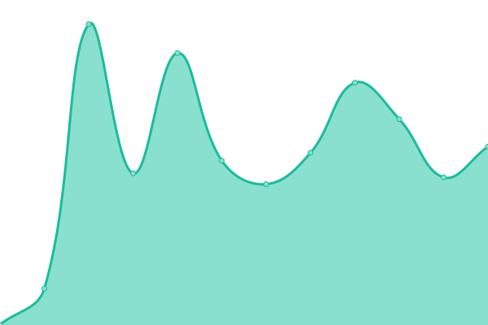

# [📈 Live Status](https://twaslowski.github.io/homelab-uptime): <!--live status--> **🟧 Partial outage**

This repository contains the open-source uptime monitor and status page for [Tobias Waslowski](https://twaslowski.github.io/homelab-uptime), powered by [Upptime](https://github.com/upptime/upptime).

With [Upptime](https://upptime.js.org), you can get your own unlimited and free uptime monitor and status page, powered entirely by a GitHub repository. We use [Issues](https://github.com/twaslowski/homelab-uptime/issues) as incident reports, [Actions](https://github.com/twaslowski/homelab-uptime/actions) as uptime monitors, and [Pages](https://twaslowski.github.io/homelab-uptime) for the status page.

<!--start: status pages-->
<!-- This summary is generated by Upptime (https://github.com/upptime/upptime) -->
<!-- Do not edit this manually, your changes will be overwritten -->
<!-- prettier-ignore -->
| URL | Status | History | Response Time | Uptime |
| --- | ------ | ------- | ------------- | ------ |
|  [Vaultwarden](https://warden.twaslowski.com) | 🟩 Up | [vaultwarden.yml](https://github.com/twaslowski/homelab-uptime/commits/HEAD/history/vaultwarden.yml) | 

 548ms
     
 | 

<a href="https://twaslowski.github.io/homelab-uptime/history/vaultwarden">99.78%</a>
    

|  [paperless-ngx](https://paperless.twaslowski.com) | 🟥 Down | [paperless-ngx.yml](https://github.com/twaslowski/homelab-uptime/commits/HEAD/history/paperless-ngx.yml) | 

 842ms
     
 | 

<a href="https://twaslowski.github.io/homelab-uptime/history/paperless-ngx">95.33%</a>
    

|  [memos](https://memos.twaslowski.com) | 🟩 Up | [memos.yml](https://github.com/twaslowski/homelab-uptime/commits/HEAD/history/memos.yml) | 

 497ms
     
 | 

<a href="https://twaslowski.github.io/homelab-uptime/history/memos">99.78%</a>
    

<!--end: status pages-->

[**Visit our status website →**](https://twaslowski.github.io/homelab-uptime)

## 📄 License

- Powered by: [Upptime](https://github.com/upptime/upptime)
- Code: [MIT](./LICENSE) © [Anand Chowdhary](https://anandchowdhary.com), supported by [Pabio](https://pabio.com)
- Data in the `./history` directory: [Open Database License](https://opendatacommons.org/licenses/odbl/1-0/)
